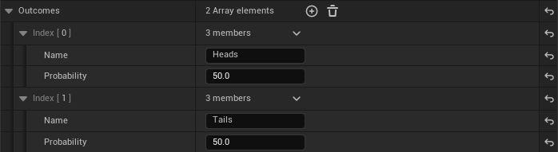
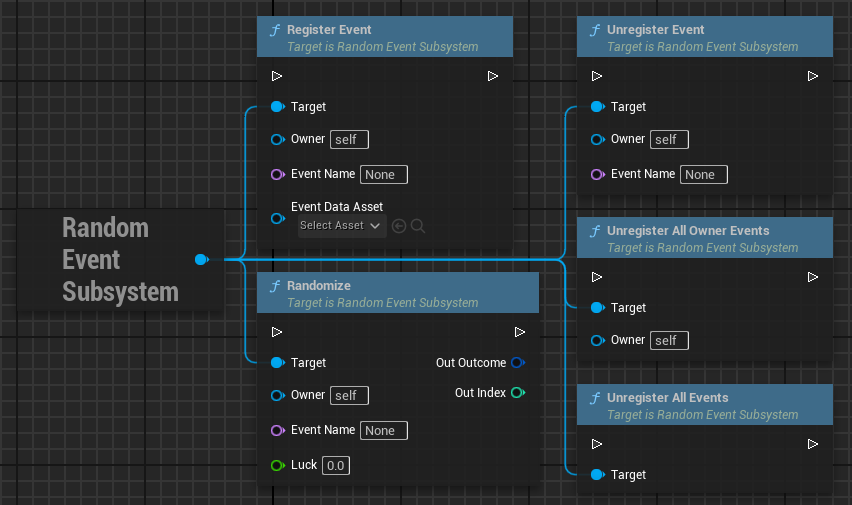

# Fair Random
An Unreal Engine subsystem plugin designed to generate pseudo-random sequences that feel fairer to players compared to pure randomness. The plugin is especially useful in scenarios where players perceive pure randomness as unfair or frustrating, such as in cases where likely outcomes do not appear frequently enough.

Players often misunderstand probability theory, and randomness can lead to negative experiences when an event with a relatively high chance fails to occur within a small sample size. To address this, the Fair Random plugin smooths the outcomes of random events over a short series of trials, providing a fairer experience without eliminating randomness.

## Why?

Let's consider a coin-flipping example to compare the algorithm's behavior with pure randomness. In an experiment of 50 trials, each consisting of 10 coin flips.

| Ratio | Pure | Fair |
| ----- | ---- | ---- |
| 5/5   | 8    | 23   |
| 6/4   | 21   | 26   |
| 7/3   | 18   | 1    |
| 2/8   | 2    | 0    |
| 1/9   | 1    | 0    |

As the table shows, pure random outcomes can lead to unexpected results, like a coin landing on the same side repeatedly. For instance, one side might appear just once in a sequence of ten flips. This randomness could lead players to believe the coin is biased, even though the chance is still technically 50/50. Fair Random reduces such extreme outcomes, creating more balanced results in small samples, while maintaining randomness with each trial.

## How to use

The plugin allows the creation of Data Assets via a Utility Widget, which describe random events with multiple outcomes.

In runtime, you can register these events by attaching them to an `Owner` object (usually the player). When it's time to trigger a pseudo-random event, call `Randomize` from the subsystem.

## Random Types

Events can be configured with different types of randomness:

- `Pure`: Standard random behavior with no adjustments.
- `Non-Repetitive`: Imagine a deck of cards where some cards are repeated, with the number of duplicates determined by the probability of each outcome. Each `Randomize` is like drawing a card from the deck.
- `Fair`: A pseudo-random approach that adjusts probabilities after each outcome to make previously selected outcomes less likely, balancing results in smaller sample sizes.

## Fair Random Algorithm

Each outcome starts with an initial probability, which is set in the Data Asset. When an event is initialized in the system, an object stores these probabilities. After each `Randomize` call, the probabilities are updated: the likelihood of the selected outcome drops to zero, and that probability is redistributed among the remaining outcomes. Redistribution is proportional to the square of the initial probabilities.

*This algorithm is not formally proven but has been empirically tested to deliver satisfactory results.*

## Testing

The plugin includes a testing feature within the Utility Widget, allowing users to simulate events and fine-tune parameters. You define the outcomes, choose the random type, and set the number of iterations. The widget simulates the trials, gathers statistical data, and presents it in a visual format, helping to assess whether an event behaves as expected or needs adjustments.

## Luck System (In Progress)

The plugin is evolving to include a "luck" system, similar to mechanics found in RPGs. Luck can drive randomness through a luck stat tied to a character. Each outcome has a "positiveness" rating, such as losing in a slot machine versus hitting the jackpot. A luckier character would have better chances of achieving more positive outcomes, while an unlucky character might face worse outcomes more often than the default probabilities would suggest.